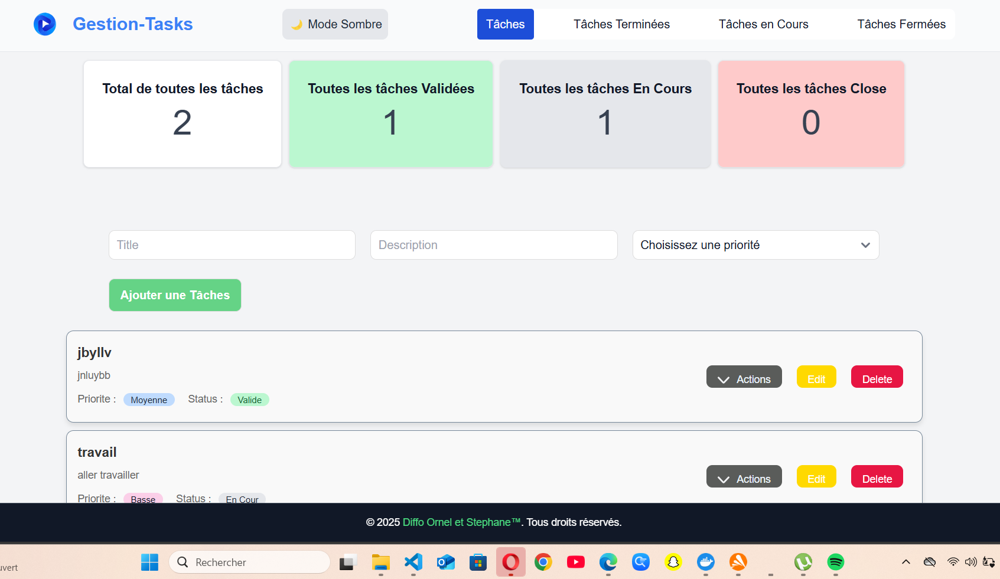
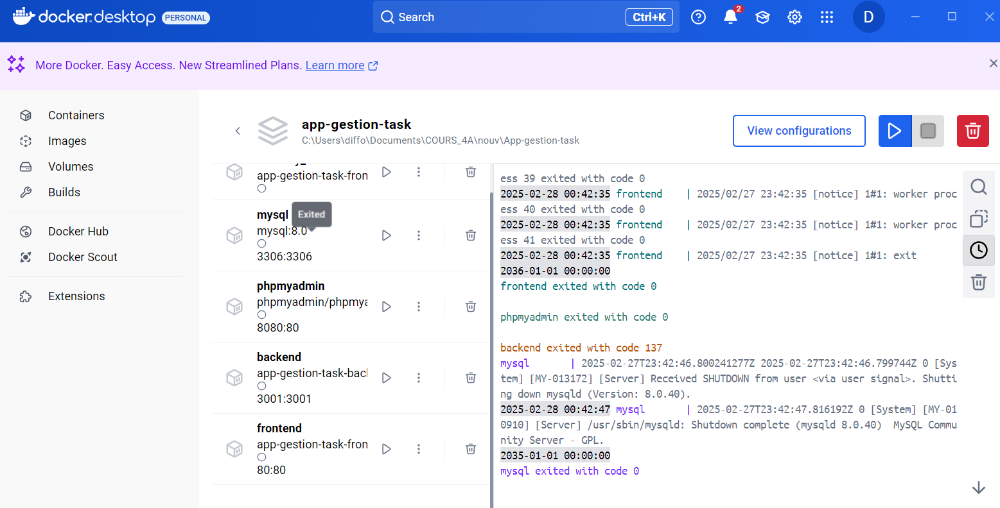

# **GESTION DE TÂCHE**

# Mon Projet Docker & Web

## 🚀 Aperçu de la Page Web
Voici une capture d'écran de la page web :



## 🐳 Conteneurs Docker
Voici l'état des conteneurs Docker :



## **Description**

Ce projet est une application de gestion de tâches (CRUD : Créer, Lire, Mettre à jour, Supprimer) développée avec **React (Vite.js)** pour le frontend, **Node.js** pour le backend, et **MySQL** comme base de données. L'application permet une gestion intuitive et efficace des tâches avec des statuts dynamiques et une interface moderne.

---

## **Fonctionnalités**

- **Créer des tâches**    : Ajouter une tâche avec un nom, une description, une priorité et un statut.
- **Afficher les tâches** : Visualiser toutes les tâches existantes avec leurs détails complets.
- **Mettre à jour les tâches** : Modifier les informations ou le statut d'une tâche existante.
- **Supprimer une tâche** : Supprimer une tâche spécifique.
- **Statut dynamique** : Affichage des badges colorés en fonction du statut (Valide, Close, En Cours).
- **Animations** : Des animations ont été ajoutées lors des opérations (création, modification, suppression).

---

## **Technologies utilisées**

### **Frontend :**

- React.js (Vite.js)
- Axios pour les requêtes HTTP
- CSS pour le style
- React Router v6
- Framer Motion pour les animations

### **Backend :**

- Node.js
- Express.js
- cors
- MySQL pour la base de données

### **Base de données :**

- MySQL avec des scripts d'initialisation (init.sql).

### **Orchestration :**

- Docker & Docker Compose

---

## **Prérequis**

- Node.js (v16+)
- MySQL (v8+)
- Docker et Docker Compose
- Un éditeur de code (VSCode, WebStorm, etc.)

---

## **Installation**

### **1. Cloner le dépôt**

```bash
git clone git@github.com:STEP-DOU/App-gestion-task.git
cd App-gestion-task
```

### **2. Backend**

1. Accédez au dossier backend :
   ```bash
   cd backend
   ```
2. Installez les dépendances :
   ```bash
   npm install
   ```
3. Configurez la base de données dans `.env` :
   ```plaintext
   DB_HOST=localhost
   DB_USER=root
   DB_PASSWORD=root123
   DB_NAME=gestion_tasks
   ```
4. Démarrez le backend :
   ```bash
   npm start
   ```

### **3. Frontend**

1. Accédez au dossier frontend :
   ```bash
   cd frontend
   ```
2. Installez les dépendances :
   ```bash
   npm install --legacy-peer-deps
   ```
3. Lancez l'application React :
   ```bash
   npm run dev
   ```

### **4. MySQL**

1. Configurez MySQL en important le fichier `init.sql` dans votre base de données.
2. Assurez-vous que la table `tasks` est créée avec la colonne `statut`.

---

## **Utilisation**

1. Ouvrez votre navigateur et accédez à :
   ```plaintext
   http://localhost:3000
   ```
2. Interagissez avec l'application pour :
   - Ajouter une tâche.
   - Modifier les informations ou le statut d'une tâche.
   - Supprimer une tâche.

---

## **Exemples de commandes MySQL**

### **Commande pour accéder à MySQL :**

```bash
docker exec -it mysql bash
```

### **Commande pour se connecter à MySQL :**

```bash
mysql -u root -p
```

### **Créer la database :**

```sql
CREATE DATABASE IF NOT EXISTS gestion_tasks;
USE gestion_tasks;
```

### **Créer la table ********`tasks`******** :**

```sql
CREATE TABLE IF NOT EXISTS tasks (
    idtasks INT AUTO_INCREMENT PRIMARY KEY,
    name VARCHAR(255) NOT NULL,
    description VARCHAR(255) NOT NULL,
    priorite VARCHAR(255) NOT NULL,
    statut VARCHAR(255) DEFAULT 'En Cours'
);
```

### **Ajouter des données :**

```sql
INSERT INTO tasks (name, description, priorite, statut) VALUES
('Tâche 1', 'Description de la tâche 1', 'Haute', 'Valide'),
('Tâche 2', 'Description de la tâche 2', 'Moyenne', 'En Cours');
```

---

## **Fonctionnalités principales**

### **Frontend :**

- Boutons **Action**, **Edit**, et **Delete** :
  - **Action** : Met à jour le statut en "Valide".
  - **Edit** : Ouvre un formulaire pour modifier la tâche.
  - **Delete** : Supprime la tâche.

### **Backend :**

- Route `/tasks` (GET) : Récupère toutes les tâches.
- Route `/register` (POST) : Ajoute une nouvelle tâche.
- Route `/edit` (PUT) : Met à jour une tâche.
- Route `/delete/:index` (DELETE) : Supprime une tâche par ID.

---

## **Docker**

### **1. Créer une image Docker**

- Backend :
  ```bash
  docker build -t backend .
  ```
- Frontend :
  ```bash
  docker build -t frontend .
  ```

### **2. Lancer Docker Compose**

```bash
docker-compose up --build
```

---

## **Améliorations possibles**

- Ajout d'une authentification utilisateur.
- Implémentation de tests unitaires.
- Gestion avancée des erreurs et validation des données.
- Notifications à l'aide de Web Push.
- Optimisation des performances avec le lazy loading des composants React.

---

## **Contributeurs**

- **DOUNGUE STEPHANE NOEL** : Développement frontend & backend.
- **DIFFO RONY ORNEL** : Développement frontend.

